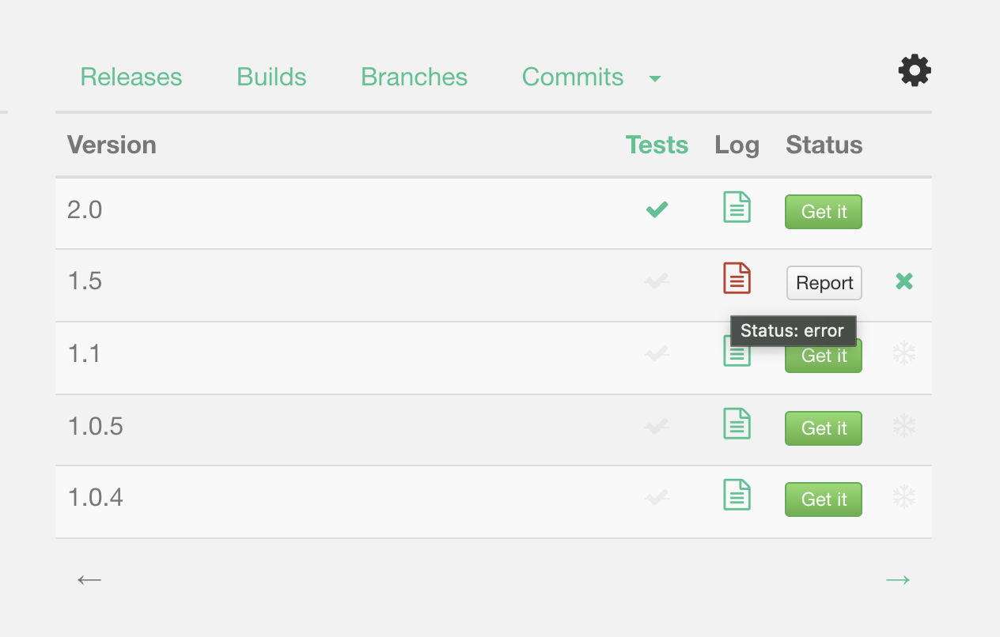

# Guide to publishing libraries

In order to publish your library on JitPack you just need a working build file in your Git repository.

JitPack currently can build **Gradle**, **Maven**, **Sbt** and **Leiningen** projects. Let us know if you want to use it with other build tools.

If the project has a build.gradle file then it will be built using Gradle otherwise JitPack will look for a pom.xml, build.sbt or project.clj file. The build.gradle file can also be located in a subfolder.

## Gradle projects

Projects using Gradle need to have either the [maven](http://gradle.org/docs/current/userguide/maven_plugin.html) or [maven-publishing](https://gradle.org/docs/current/userguide/publishing_maven.html) plugin enabled. For example, if you add this to your build file:

```gradle
    apply plugin: 'maven'
    
    group = 'com.github.YourUsername'
```

then JitPack will run:

```gradle
    ./gradlew install
```

to install the jar and pom file in it's local maven repository. With maven-publishing plugin it will run `./gradlew build publishToMavenLocal`. 

Note that if your project isn't using a Gradle wrapper JitPack will build it with a recent version of Gradle. Therefore it is recommended to use the wrapper.

### Example projects

 - Simple - https://github.com/jitpack/gradle-simple
 - Multiple modules - https://github.com/jitpack/gradle-modular
 - Project with multiple artifacts - https://github.com/jitpack/gradle-multiple-jars

## Android projects

See the [Guide to publishing Android libraries](ANDROID.md) with Gradle

## Maven projects

JitPack will run: 

    mvn install -DskipTests
    
to build and publish Maven projects. 

### Example projects

 - Simple - https://github.com/jitpack/maven-simple

 - Multiple modules - https://github.com/jitpack/maven-modular
  
# Multi-module projects

If the project builds multiple modules JitPack will append the repository name to the artifact's groupId and the module's name will stay in the artifactId. It will also generate a module that includes all of repository's modules as dependencies. That way if you don't know which module you want you can get all of them by adding just a single dependency to your build file.

To get individual artifacts of multi-module builds use `com.github.User.Repo` as group Id and `ModuleName` as the artifact Id.

Individual module in Gradle:

```gradle
compile 'com.github.User.Repo:Module:Tag'
```
or in Maven:

```xml
<dependency> 
	<groupId>com.github.User.Repo</groupId> 
	<artifactId>Module</artifactId> 
	<version>Tag</version> 
</dependency>
``` 

To get all modules of a project use the standard syntax:
```gradle
compile 'com.github.User:Repo:Tag'
```

Examples:

 - Multiple Gradle modules - https://github.com/jitpack/gradle-modular

 - Multiple Maven modules - https://github.com/jitpack/maven-modular

## Sbt projects

JitPack can build sbt projects and also provide dependencies to sbt. 
When building an Sbt project JitPack will run:

    sbt publishM2

To use JitPack repository from sbt add this to build.sbt:
```sbt
resolvers += "jitpack" at "https://jitpack.io"
```
and then use:
```sbt
libraryDependencies += "com.github.User" % "Repo" % "Tag"
```

JitPack also supports cross-building with the %% syntax:
```sbt
libraryDependencies += "com.github.User" %% "Repo" % "Tag"
```
which will build the dependency with your current Scala version by calling `sbt ++SCALA_VERSION`.

## Leiningen projects

When building a Leiningen project JitPack will run:

    lein do clean, install
    
To use JitPack from Leiningen add the repository to your project.clj:
```clojure    
:repositories [["jitpack" "https://jitpack.io"]]
```

and then the dependency:

```clojure
:dependencies [[com.github.User/Repo "Tag"]]
```

# Build environment

Each build will have these environment variables:

- `JITPACK=true`

- `JAVA_HOME=<detected java home>`

- `GIT_COMMIT=<commit at which we're building>`

- `GIT_BRANCH=<current branch>`

- `GIT_DESCRIBE=<output of git describe command>`

# Build customization

You can create a `jitpack.yml` file in the root of your repository and override the build commands:

```yml
jdk:
  - oraclejdk8
before_install:
   - ./prepareEnvironment.sh
install:
   - echo "Running a custom install command"
   - mvn clean install -DskipTests
```

The `install` command is expected to create build artifacts somewhere in the project's directory and
*also* to copy them to the local Maven repository `~/.m2/repository`.

## Java version

JitPack will compile projects using Oracle Java 8. See the example projects on how to set a different target version in your build file. 

Maven projects that specify a target version in their pom will be built with that target version.

If your project uses Travis or Circle CI then JitPack will read the lowest jdk version from yml file and use that to build.

Alternatively create a `jitpack.yml` file in the root of your repository and specify a jdk version:
```yml
jdk:
  - oraclejdk8
```

# Troubleshooting

If there is an issue with a build you will see a link to the log in the Status column. 

   

You can also inspect the build log using the URL:

```
https://jitpack.io/com/github/User/Repo/Tag/build.log
```

and browse the files:

```
https://jitpack.io/com/github/User/Repo/Tag/
```

Although we monitor builds feel free to get in touch any time you face an issue or click the Report button. 
The easiest way is to open a GitHub issues or come chat on https://gitter.im/jitpack-io

## Building ahead of time

You can also build snapshots on each commit if you add a GitHub Webhooks. For example by calling this kind of url on every commit: 
`https://jitpack.io/com/github/User/Repo/-SNAPSHOT/build.log`

To add, head to repository Settings -> Webhooks & Services -> Add webhook.

For private repositories you will need to pass the authentication token:
`https://jitpack.io/com/github/User/Repo/-SNAPSHOT/build.log?access_token=AUTHENTICATION_TOKEN`

## Rebuilding

You can remove builds that didn't succeed if you *Sign In* on [JitPack.io](https://jitpack.io) and look up your repository. Requesting them again will result in the project being rebuilt.

You may need to run gradle with `--refresh-dependencies` flag in order to re-fetch the dependency. In maven use the `-U` flag.

## Clean gradle cache

To clean the Gradle cache delete the HOME_DIR/.gradle/caches directory.

