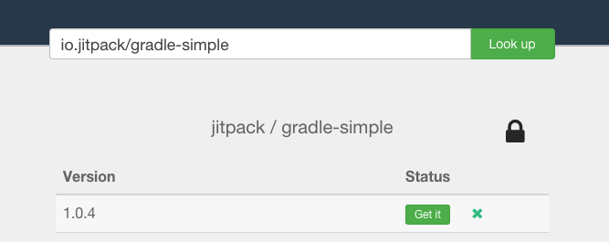

# Private Repositories

JitPack supports building and installing from private Git repositories. Build artifacts are also kept private and you can only download them if you have access to the Git repository itself. 

You can also share your build artifacts (jar, aar) publicly while keeping the source code private. For example, you can easily distribute your library to your users without giving them access to code.

## Set up

To start using private repositories you will first need to grant JitPack access. Open [https://jitpack.io/private](https://jitpack.io/private#auth) and follow the steps:

1. Click Authorize to get an authentication token
2. Order your JitPack Account [here](https://jitpack.io/private#subscribe)
3. Add the token to $HOME/.gradle/gradle.properties like this:
    - `authToken=AUTHENTICATION_TOKEN`
	
    - For Maven add the token to 	$HOME/.m2/settings.xml :

```xml
<settings>
  <servers>
        <server>
          <id>jitpack.io</id>
          <username>AUTHENTICATION_TOKEN</username>
          <password>.</password>
        </server>
  </servers>
</settings>
```

The id of the server must be the same you use in your pom.xml for JitPack.io.

### Bitbucket

Create a Team in Bitbucket and generate an API key for that team. Use the API key as an authentication token.

## Usage

Once you are set up you can try installing one of your private repositories:

1. Go to [https://jitpack.io/private](https://jitpack.io/private) and 'Look up' your private repository.
2. Follow the instructions and add credentials to your build file if using Gradle:

```gradle
repositories {
	maven {
		url "https://jitpack.io"
		credentials { username authToken }
	}
}
```

Then add the dependency to your private repository just like you do with a public one:

```gradle
dependencies {
	compile 'com.github.User:PrivateRepo:Tag'
}
```

## Private dependencies

Your private GitHub projects can have dependencies on other GitHub projects. JitPack supports resolution of these dependencies seamlessly and there's no extra configuration required. The token you use to build the first project will also be used to build it's dependencies.

## Permissions

Private repository builds are accessible to you and anyone who has Push permissions for the Git repository itself. For example, you may trigger a build of your library and your colleague will be able to install the library straight away.

Your private repository source code remains private.

## Artifact sharing

In some cases you want to distribute your project publicly while keeping the source private. In this case:

1. Sign In on JitPack.io homepage
2. Look up your private repository
3. Click on the Lock icon to make the builds public:

   

Once the Lock icon turns to unlocked the project's build artifacts become public. That means your users will be able to install your library without needing an authentication token.


## Custom domain

If your organisation's GitHub url is https://github.com/yourcompany then by default the groupId of your artifacts will be 'com.github.yourcompany'. If you want to use your own domain name as groupId, you can.

JitPack supports mapping your domain name to your GitHub organization. Then instead of 'com.github.yourcompany' groupId you can use 'com.yourcompany' while the name of the project and version remains the same. 

To enable your own domain name:  

  1. Add a DNS TXT record that maps git.yourcompany.com to https://github.com/yourcompany  

  2. Go to https://jitpack.io/#com.yourcompany/yourrepo and click Look up. If DNS resolution worked then you should see a list of versions.   

  3. Select the version you want and click 'Get it' to see Maven/Gradle instructions.  

Example: [https://jitpack.io/#io.jitpack/gradle-simple](https://jitpack.io/#io.jitpack/gradle-simple)

To check that the DNS TXT record was added run the command `dig txt git.yourcompany.com`. For example:

```
> dig txt git.jitpack.io
...
;; ANSWER SECTION:
git.jitpack.io.		600	IN	TXT	"https://github.com/jitpack"
```
